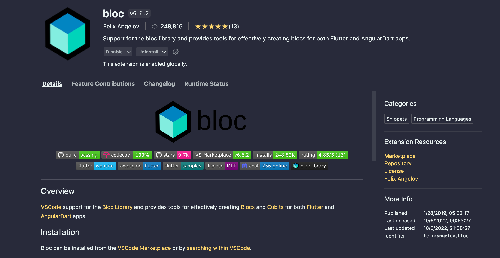
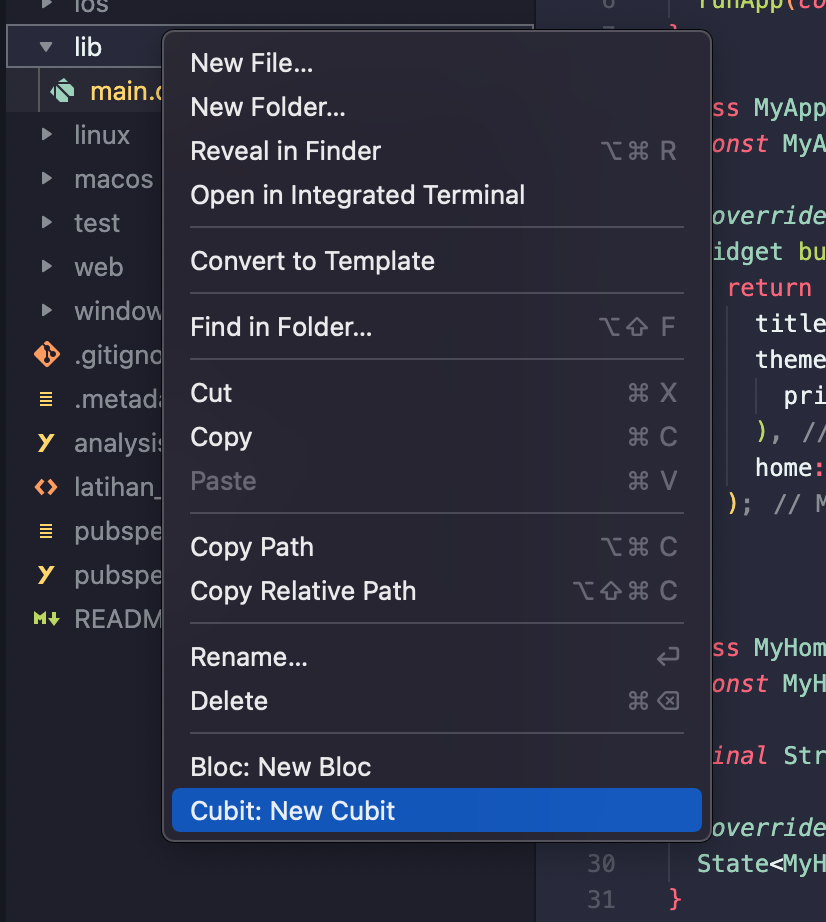

# State Management

## StreamController & StreamBuilder
Salah satu kekurangan setState yang ada di StatefulWidget yaitu akan merebuild semua komponen didalam build method termasuk yang tidak ada kaitannya dengan state yang berubah. Tentunya ini akan sangat tidak efektif ketika screen yang dibuat sudah terdiri dari banyak widget tree. Di flutter ada salah satu kelas yang membantu kita untuk mengimplementasikan reactive programming yaitu StreamBuilder dan StreamController. StreamController berfungsi untuk menampung nilai, sedangkan StreamBuilder berfungsi untuk mengamati perubahan nilai di StreamController dan akan me-rebuild widget tree ketika terjadi perubahan state.

```dart
import 'dart:async';

import 'package:flutter/material.dart';

void main() {
  runApp(const MyApp());
}

class MyApp extends StatelessWidget {
  const MyApp({super.key});

  @override
  Widget build(BuildContext context) {
    return MaterialApp(
      title: 'Flutter Demo',
      theme: ThemeData(
        primarySwatch: Colors.blue,
      ),
      home: const MyHomePage(title: 'Flutter Demo Home Page'),
    );
  }
}

class MyHomePage extends StatefulWidget {
  const MyHomePage({super.key, required this.title});

  final String title;

  @override
  State<MyHomePage> createState() => _MyHomePageState();
}

class _MyHomePageState extends State<MyHomePage> {
  final _controller = StreamController<int>();

  int counter = 0;

  @override
  void initState() {
    super.initState();
  }

  @override
  void dispose() {
    _controller.close();
    super.dispose();
  }

  @override
  Widget build(BuildContext context) {
    return Scaffold(
      appBar: AppBar(
        title: Text(widget.title),
      ),
      body: Center(
        child: Column(
          mainAxisAlignment: MainAxisAlignment.center,
          children: <Widget>[
            const Text(
              'You have pushed the button this many times:',
            ),
            StreamBuilder<int>(
              stream: _controller.stream,
              initialData: counter,
              builder: (context, snapshot) {
                return Text(
                  '${snapshot.data}',
                  style: Theme.of(context).textTheme.headline4,
                );
              },
            ),
          ],
        ),
      ),
      floatingActionButton: FloatingActionButton(
        onPressed: () {
          counter += 1;
          _controller.add(counter);
        },
        tooltip: 'Increment',
        child: const Icon(Icons.add),
      ),
    );
  }
}
```

## BuildContext
Sebelum masuk ke pembahasan state management, ada baiknya kalau kita memahami terlebih dahulu tentang BuildContext yang ada di flutter. Singkatnya, BuildContext merupakan sebuah instance yang berisi informasi posisi widget dalam widget tree yang saat ini ditampilkan.


Pada gambar diatas, **Icon** merupakan **child widget** dari **Column** yang merupakan **child widget** dari **Row** . Dan **Row** sendiri merupakan **child widget** dari **Container** . BuildContext ini yang juga nantinya akan kita gunakan sebagai media untuk meng-inject instance ke dalam widget tree.


## BLoC Pattern
BLoC (Business Logic Component) pattern merupakan pattern untuk memisahkan antara UI dan business logic.


Anggaplah Event itu adalah aksi yang dilakukan oleh user. Sedangkan State adalah perubahan data yang disebabkan oleh event tertentu. Untuk mengimplementasikan bloc pattern, sebenarnya kita bisa menggunakan StreamBuilder dan StreamController, namun akan lebih baik jika kita menggunakan library yang memang diperuntukkan untuk mengimplementasikan pattern tersebut, salah satunya yaitu library flutter_bloc . Perlu diketahui bahwa flutter_bloc memiliki 2 versi state management, yang pertama adalah bloc dan yang lain bernama cubit. Perbedaan keduanya hanyalah pada cara bagaimana Event ditangani, dimana pada bloc mengharuskan kita untuk membuat class Event, sedangkan pada cubit kita dapat langsung memanggil method didalam class bloc nya sehingga lebih simpel. Langsung saja mari kita coba mengimplementasikan bloc pattern menggunakan flutter_bloc.

1. Install ekstensi flutter bloc di vscode / android studio



2. Tambahkan library flutter_bloc di pubspec.yaml

```yaml
dependencies:
    flutter_bloc: ^8.1.1
```

3. Buatlah kelas cubit dengan klik kanan pada folder lib > Cubit: New Cubit . Lalu namai dengan **counter**



4. Akan ada 2 file baru dengan nama counter_cubit.dart dan counter_state.dart. Lalu buka file counter_state.dart dan buatlah kelas State baru yang meng-extends dari kelas **CounterState** dengan nama **CurrentCounterState**

```dart
// counter_state.dart
part of 'counter_cubit.dart';

@immutable
abstract class CounterState {}

class CounterInitial extends CounterState {}

class CurrentCounterState extends CounterState {
  final int counter;

  CurrentCounterState(this.counter);
}

```
kelas CurrentCounterState di atas memiliki property counter yang akan digunakan untuk menampung nilai statenya.

5. Lalu buka file counter_cubit.dart dan buatlah method baru dengan nama **increment**

```dart

// counter_cubit.dart
import 'package:bloc/bloc.dart';
import 'package:meta/meta.dart';

part 'counter_state.dart';

class CounterCubit extends Cubit<CounterState> {
  CounterCubit() : super(CounterInitial());

  int counter = 0;

  void increment() {
    counter += 1;
    emit(CurrentCounterState(counter));
  }
}

```
